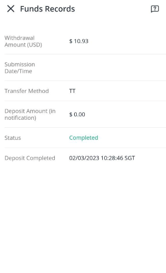

## Introduction

Recently, I opened a Webull Singapore account and the experience has been good so far. However, although the fee structure for deposits and withdrawals in SGD (with a Singapore bank account) is clearly stated, it's not so clear on depositing/withdrawing other currencies like USD using a multi-currency account. 

Since Webull uses a DBS multi-currency account under the hood to hold our funds, supposedly if we deposit or withdraw USD using a DBS multi-currency account as well, there should be no charges. Sadly, there's no official statement to verify the assumption, not to mention the scary "SGD20 charged by remitting bank for USD" mentioned on the [official FAQ](https://www.webull.com.sg/help/faq/1062-Are-there-any-withdrawal-fees).

Regardless, I eventually tried to deposit and withdraw using a DBS account, and it was **indeed zero charges**👏. In the following section, I will demonstrate how I did it so that you can be assured that it works.

## Getting Started

Note that the below steps are only applicable for **DBS multi-currency accounts** in Singapore; there's no guarantee that 0 fee would apply for multi-currency accounts from other banks.

### Deposit

1. On the Webull mobile app, go to your account section and find `Deposit > Telegraphic Transfer (TT) > USD`. You should be able to see the account details that you should deposit your fund to, as shown below: 
 
Take note of the remarks as it will be needed later when making your deposit.

1. Then, launch your DBS digibank app and go to "Pay & Transfer" section. Click `Add Local Recipient > DBS Foreign Currency Corporate Account` to add Webull as a payee.

1. Then, input your previous Webull account details into the subsequent prompts. I made some minor changes to some details because the prompts wouldn't let me pass otherwise:
    - SWIFT Code: *DBSSSGSGXXX* (add XXX)
    - Recipient's full name: *Webull Securities SG Pte Ltd* (no brackets and dots)
    - Full Address: *DBS Singapore* (to be within the character limit)

1. After the payee is added successfully, click the payee to go to the transfer page:

    - Make sure to select USD as your source account, and
    - Input the remarks from your Webull app into the "Comments" box.

    Then, input the amount you want to transfer, click next, and follow the prompts to confirm the transfer.

1. After you have completed the transfer, note down the reference number on the confirmation page for your reference:

That's it!🎉 In a few seconds, you should be able to receive a notification from Webull about the successful deposit without even having to "Notify Webull of Transfer Completion". 

The amount reflected in Webull will be exactly the same as the amount you transfered, and neither side charges any transfer fee.

### Withdrawal

1. On the Webull mobile app, go to your account section and click `Withdraw > Withdraw USD`.
1. If you haven't added your DBS bank account as a recipient, click "Add Bank Account" and fill up the details.
    - The account type should be "Multi-Currency Account".
    - The bank number is your typical DBS account number that looks like "XXX-XXXXXX-X".
1. After that, choose the DBS multi-currency account as recipient:

1. Input the amount you want and click "Submit Withdrawal Request".

Shortly, you should be able to see the exact amount being deducted from Webull and successfully deposited into your DBS USD account without any charges🎉:

## Summary
Although not written explicitly, we are able to deposit and withdraw directly in USD between Webull and DBS multi-currency account without any charges. This is very handy if we already have some USD in our DBS bank account because we could skip the undesired currency exchange rate given by the broker. 

Leave a like if you think this is useful!