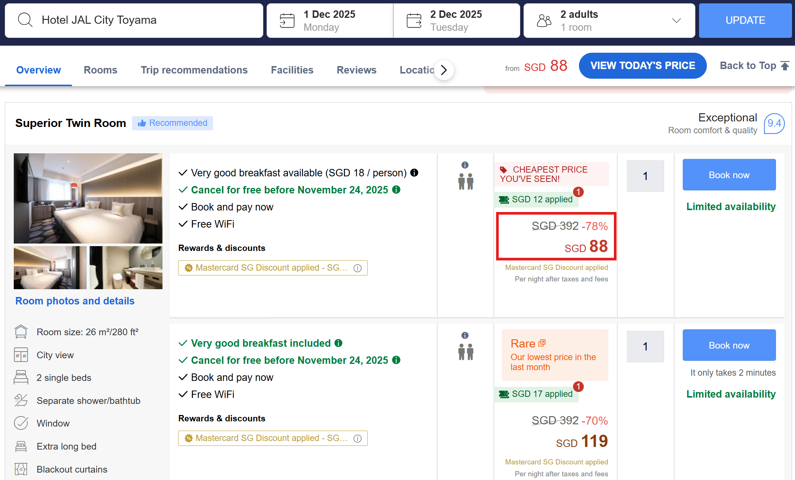
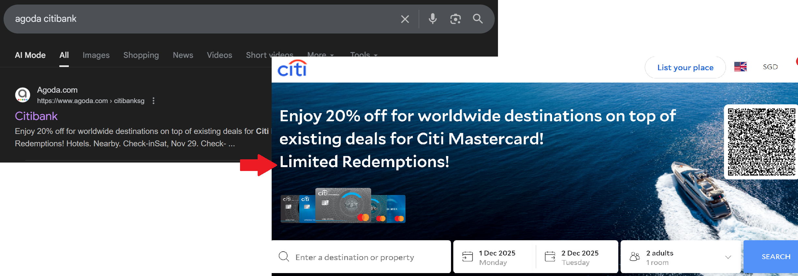

# Introduction
I go on at least one trip every year, and one of the biggest expenses is always the accommodation. Imagine you spend $200 dollars per night for 10 days — $2000 in total. Imagine again you know the trick to save 15% to 20% on each booking — that is $300 to $400 dollars saved! In this article, I'm going to show you exactly how to find such deals, and it's simpler than you think.

# Step 1: Google Hotels
[Google Hotels](https://www.google.com/travel/search) is super convenient and I especially love the map view which makes it easy to see where exactly I will be staying. Most importantly, it shows the price across different sites like Agoda, Expedia, etc., which makes price comparison much easier. I can usually find a cheaper price here than searching on other websites. 

**Quick tip:** Always click into the official hotel website (if any), sometimes official has the best deal!

Once you have identify a hotel you like, you can start looking for discounts.

# Step 2: Apply Easy 15%-20% Hacks
## 1. Agoda  Hacks (My Favorite)
Agoda is weird — clicking the link through Google Hotels can have a different price than searching directly on Agoda; searching on Agoda mobile app can be cheaper/more expensive; most importantly, **there are various credit card affiliated Agoda links that would instantly give you 15% - 20% discounts!**

My favorite keywords which almost always work are:
- Agoda 20/18/15 off
- Agoda citibank
- Agoda mastercard

You can also try other keywords like:
- Agoda HSBC 20
- Agoda UOB
- etc.

Here are the results through different ways of searching.

### Normal search on Agoda (Bad)

### Keyword: Agoda 20 off → instant 12% off with Mastercard

### Keyword: Agoda citibank → instant 16% off with Citibank

Note that for credit card affiliated links, you will actually need an eligible credit card for the discounts. You can easily apply for one and it usually comes with no cost.

### Pitfalls

- Although Agoda gives good savings most of the time, beware that it is not always the cheapest.
- Avoid pay later — you will be slapped with a 5% surcharge. Google online and you will find various complaints online about this hidden charge. (*However, as of Nov 2025, I don't see the mentioned of hidden charge in Agoda's T&C anymore, perhaps they have finally found their conscience.*)

## 2. Other Credit Card Deals

Keep a look out for ongoing credit card deals — there are usually some discounts going on at any moment of time! What I would do is usually doing some random keyword search in the format of "\<platform\> \<credit card\> discounts". For example, this was how I got 20% off Klook:

# Summary

There are a lot of deals out there for booking hotels if you know where to look. Never lose out on easy savings again!