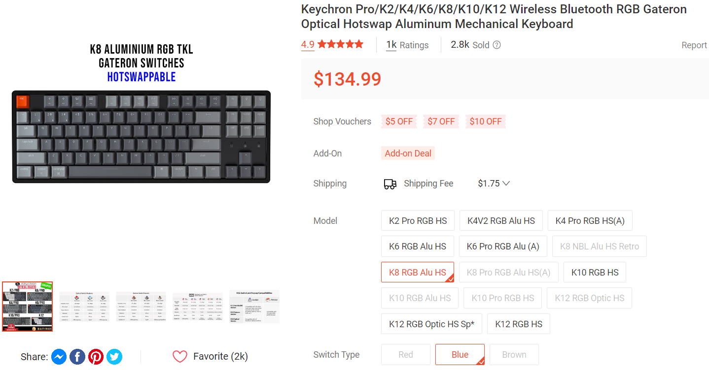

***2025 Update:** Keychron has [officially arrived in Singapore](https://www.keychronsg.com/), so the price difference may not be as much anymore, but getting directly from the US site can still be a better deal!*

**TL;DR You can buy Keychron directly from their US official website and ship to Singapore without any extra tax!**

# Introduction
Keychron keyboards sold by dealers in Singapore are usually more expensive than the price on Keychron's official website, not to mention Keychron often has sales that makes the price difference even more stark. 

For example, as of *12 May 2023*, the **official** price of Keychron K8 RGB aluminum Hot-Swappable costs ~101.82 SGD:

While the same model on **Shopee** costs 135 SGD:

Granted, you need to add an extra 10 USD for the shipping fee if you buy from the official store, but in this case it's still cheaper than buying from dealers.

# Extra Charges?
However, it's unclear if there would be any extra charges like import tax since it's shipping from overseas to Singapore. [Keychron's shipping policy](https://www.keychron.com/pages/shipping-policy#:~:text=VAT%20or%20import%20tax%20included%3F) says that:

> Due to the customs policy of different destinations, we CANNOT guarantee if there is a tax for you. Our product price does not include VAT or import tax of your shipping destination.

But it adds that:

> From our previous experience, the following destinations haven’t been charged for import tax including the U.S, **Singapore**, South Korea and other EU (except remote area) such as Austria, Belgium, Bulgaria, Croatia, Czech Republic, Denmark, Estonia, Finland, France, Germany, Hungary, Ireland, Italy, Latvia, Luxembourg, the Netherlands, Poland, Portugal, Slovakia, Slovenia, Spain, Sweden, United Kingdom

The ambiguity adds uncertainty to the final price, but I decided to try my luck since the deal is too good to pass. 

# The Process
## Buying
When buying, I put my Singapore address as the shipping address, and my Singapore phone number as the contact number. Nothing too fancy.

I used my DBS multi-currency card (with sufficient USD inside) to pay so that it charges exactly the amount in USD without any conversion fee.

## Shipping
The keyboard was shipped out 2 business day later.

## Receiving
It only took 5 business days (one week) for the keyboard to arrive after it was shipped out.

And that's it, no extra fee or tax imposed when receiving the keyboard!

# Summary
There is no extra tax if you buy Keychron from the official website and ship it to Singapore, at least from my experience as of 2023. If your country is on the above list mentioned, chances are you could safely assume that there'd be no import tax as well. 

Hope this helps those of you who hesitate to buy from the official store due to the import tax. Cheers!