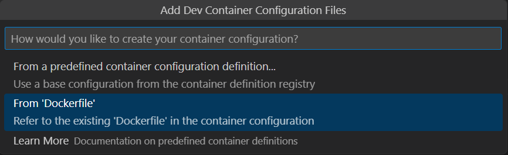
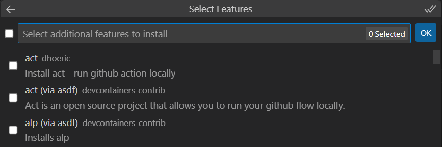
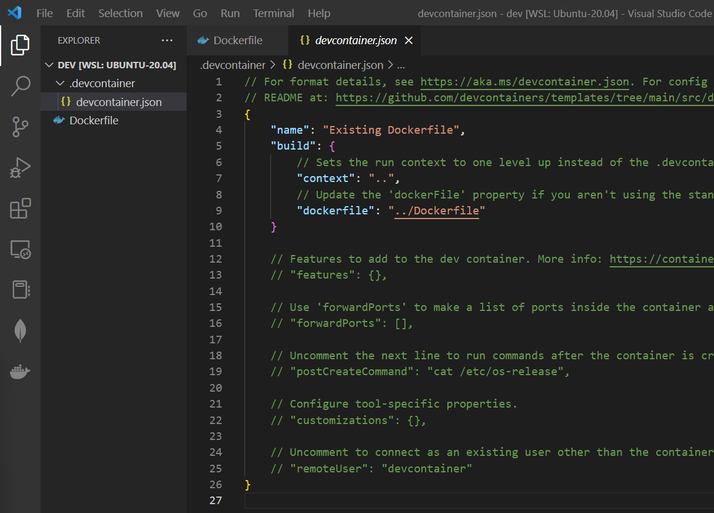

## Introduction

Whenever we want to start working on a new project with new tools or frameworks, the first step is always to install the dependencies for local development. However, the installation process could be painful especially if different versions of existing tools are needed, forcing us to have multiple versions that eat up the storage space on our device. Not to mention, the installed tools could be located all over the place, making it hard to locate and uninstall them when they are no longer needed.

For those of you who have used Docker before, I think we could all agree that it is a very handy tool to manage dependencies. We just need to package everything that our application needs into the Docker image, then we could simply run our application using Docker in any environment. 

Normally, Docker is used for deployment, but today we are going to utilize its power to setup our development environment to eliminate the need to install any tools locally. We will use a powerful Visual Studio Code (VSCode) extension, *Dev Containers*, to achieve the seamless development process.

## Prerequisites

Before we begin, make sure that you have the following software installed:

- **Docker**: https://www.docker.com/get-started.
- **Visual Studio Code**: https://code.visualstudio.com/.
- **Dev Containers extension for VSCode**: https://marketplace.visualstudio.com/items?itemName=ms-vscode-remote.remote-containers.

## Getting Started

In short, Dev Containers mounts our project folder into a Docker container, so we could then run our project using the dependencies that reside in the container. 


Therefore, a typical development workflow looks like this:

1. Write a Dockerfile that contains all dependencies needed to run our application.
1. Run Dev Containers, which will create a Docker container using the Dockerfile we created and mount our project folder into it.
1. Modify our source code on VSCode and run our application on VSCode terminal which is connected to the container.

To demonstrate, we will use this workflow to develop and run a Node.js web application. The final code could be found in [Resources](#resources) at the end of the blog.

### Setting up VSCode with Dev Containers

1. First, create a new folder for the project.
1. Launch VSCode and click `File > Open Folder` to open the folder just created.
    - ⚠️If your Docker is installed in Windows WSL, you need to download the [WSL extentsion](https://marketplace.visualstudio.com/items?itemName=ms-vscode-remote.remote-wsl). Then, open the Command Palette in VSCode by pressing `Ctrl+Shift+P`, and type and choose "WSL: Open Folder in WSL" instead.
1. Create a `Dockerfile` in the project folder with the following content:
    ```dockerfile
    FROM node:18-alpine
    ```
    This creates an environment with Node.js runtime and change our starting directory to `/app`.
1. Open the Command Palette in VSCode by pressing `Ctrl+Shift+P` (Windows, Linux) or `Command+Shift+P` (Mac). 
1. Type and choose "Dev Containers: Add Dev Container Configuration Files." In the next prompt, choose "From Dockerfile."

1. Then in the Select Features prompt, press "OK" without selecting any additional feature.

1. A `devcontainer.json` will then be created under the .devcontainer folder.

    - `build.context` sets the path that the Docker build should be run from relative to `devcontainer.json`, which in this case is where our Dockerfile is located. 
    - `build.dockerfile` points to the location of a Dockerfile that defines the contents of the container, which we defined.
1. Open the Command Palette again and choose "Dev Containers: Rebuild and Reopen in Container"
1. The workspace will be reopened in the container, and if we press `` Ctrl+` `` to bring up the integrated terminal, we can see that we are inside the container environment!

By default, Dev Containers mounts our project folder to `/workspaces/{project_name}` in the container. Thus, any file we create inside the virtual environment will also be reflected in our local folder.

### Building our Application

1. In the terminal, run: 
    ```bash
    npm init
    ```
    and keep pressing `Enter` until the end of the prompt.
1. Install Express framework:
    ```bash
    npm install express
    ```
1. Create a file named `index.js` with the following content:
    ```javascript
    const express = require('express')
    const app = express()
    const port = 3000

    app.get('/', (req, res) => {
        res.send('Hello World!')
    })

    app.listen(port, () => {
        console.log(`Example app listening on port ${port}`)
    })
    ```
1. Start the server:
    ```bash
    node index.js
    ```
1. Open a local browser and visit `http://localhost:3000` to see the running server.
    - Note that VSCode automatically helps us map local port 3000 to that of the container, so we don't need to configure it explicitly.

And there we go! We have successfully developed and run a Node.js application without having to installed the tools locally.

### Finishing Off

To make the tutorial complete, we should also package our application properly for deployment/distribution later. Update the `Dockerfile` with the following content:

```dockerfile
FROM node:18-alpine

WORKDIR /app
COPY package*.json ./
RUN npm install
COPY . .

EXPOSE 3000

CMD ["node", "index.js"]
```

Then, in a **local** terminal, we could then run our program using the following commands:

```bash
# Inside the project directory
docker build -t dev-container .
# Make sure the previous application in VSCode is stopped before running this
docker run --rm -p 3000:3000 dev-container
```

Now, our application is ready to be shipped.


### Some Notes

- We use the same Dockerfile for both development and deployment, but you could choose to use different files to avoid confusion. However, that comes with the cost of potential descrepency between development and deployment.
- There are a lot more configurations that you could do with the container environment through `devcontainer.json` according to your needs. Read the [official documentation](https://code.visualstudio.com/docs/devcontainers/containers) to learn more. 
- If we create files through a dev container, there could be some permission issues when accessing them locally. Git commands might encounter permissions issues as well. To resolve them, we may have to manually change the files permission or go through the pain of [setting up a non-root user](https://code.visualstudio.com/remote/advancedcontainers/add-nonroot-user).

## Summary

We have demonstrated how to use Dev Containers and VSCode to develop and package a web application. It is a very powerful tool that helps us manage dependencies which we otherwise have to manage on our local machine ourselves. If you are a big fan of minimizing local tools installation like me, you should definitely check this out.

## Resources

- Code for this tutorial: https://github.com/CookieHoodie/tutorials/tree/main/dev_containers