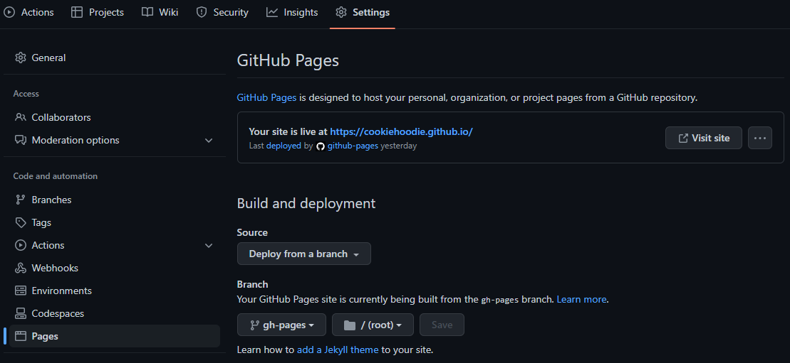
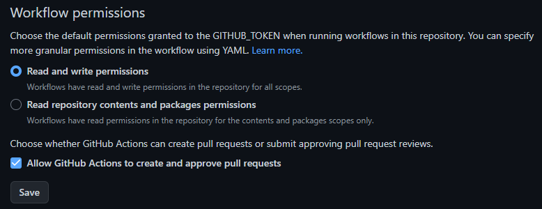

## Introduction
Recently, I was building my [portfolio site](https://cookiehoodie.github.io) using React and the built-in create-react-app toolchain. The webpage worked well and I was able to deploy it on GitHub Pages with ease. However, create-react-app uses client-side rendering, which causes an obvious layout shift of the components when the page is first loaded or refreshed. Not a big deal, but it's annoying😠.

Since the webpage doesn't change often, the best solution is to utilize static site generation (SSG), which pre-renders the page and thus eliminate the layout shift. Unfortunately, create-react-app doesn't provide the functionality out of the box, and although there are some third-party packages such as react-snap that do the job, they are outdated and don't support the latest React versions.

Therefore, I decided to migrate to Next.js, a popular React framework for building web applications with server-side rendering and static site generation functionalities. The migration process is quite simple, and in this post I will guide you through how I did it, using my own site as example. 

## Getting Started

The complete code changes could be found in [resources](#resources).

### Migrate to Next.js

1. First, uninstall react-scripts and install Next.js:
    ```bash
    npm uninstall react-scripts
    npm install next
    ```
    
1. Then, replace the scripts in `package.json` from react-scripts:
    ```json
    // package.json
    {   ❌
        "scripts": {
            "start": "react-scripts start",
            "build": "react-scripts build"
        }
    }
    ```
    to Next.js:
    ```json
    // package.json
    {
        "scripts": {
            "start": "next start",
            "build": "next build",
            "export": "next export",
            "dev": "next dev"
        }
    }
    ```

1. Then, create a folder named `pages` in the root directory, and add a file named `_document.js` with the following content:
    ```jsx
    /* pages/_document.js */
    import { Html, Head, Main, NextScript } from "next/document";

    export default function Document() {
        return (
            <Html>
                <Head>
                    <link rel="icon" href="/favicon.ico?" />
                    <meta name="description" content="Chin Hang's Portfolio" />
                    <link rel="apple-touch-icon" href="/logo192.png" />
                    <link rel="manifest" href="/manifest.json" />
                </Head>
                <body>
                    <Main />
                    <NextScript />
                </body>
            </Html>
        );
    }
    ```
    The content in `<Head>` was copied from that of `<head>` in `public/index.html`. Note that we remove the `%PUBLIC_URL%` from the href:
    ```html
    <!-- public/index.html -->
    <link rel="icon" href="%PUBLIC_URL%/favicon.ico?" />
    ```
    to:
    ```jsx
    /* pages/_document.js */
    <link rel="icon" href="/favicon.ico?" />
    ```
    In short, this document is where we add the `<head>` code that are common to all pages, which Next.js will later pick up for page rendering. Also note that some other metadata such as title, viewport, and charSet are not placed here but rather in `pages/_app.js`, which will be created later. The `<Main />` and `<NextScript />` components are needed by Next.js and are not of our concern. 

1. Inside the same `pages` folder, create another file named `_app.js` with the following content:
    ```jsx
    /* pages/_app.js */
    import Head from "next/head";

    export default function MyApp({ Component, pageProps }) {
        return (
            <>
                <Head>
                    <meta charSet="utf-8" />
                    <meta name="viewport" content="width=device-width, initial-scale=1" />
                    <title>Chin Hang's Portfolio</title>
                </Head>
                <Component {...pageProps} />
            </>
        );
    }
    ```
    In short, this document is the starting point where all the pages are initialized, and thus is useful for making changes that are common to all pages such as adding global css. Here, we put the rest of the metadata such as viewport and title as [recommended by Next.js](https://nextjs.org/docs/advanced-features/custom-document#:~:text=The%20%3CHead%20/%3E%20component%20used%20in%20_document%20is%20not%20the%20same%20as%20next/head.%20The%20%3CHead%20/%3E%20component%20used%20here%20should%20only%20be%20used%20for%20any%20%3Chead%3E%20code%20that%20is%20common%20for%20all%20pages.%20For%20all%20other%20cases%2C%20such%20as%20%3Ctitle%3E%20tags%2C%20we%20recommend%20using%20next/head%20in%20your%20pages%20or%20components.). I put the `<title>` here because my site is a single-page application and thus all pages share the same title.

1. We can now delete `public/index.html` since it's not used anymore.

1. Rename the `src` folder to `components`, which is the convention used in Next.js.

1. Then, we create another file named `index.js` inside the `pages` folder with the following content:
    ```jsx
    /* pages/index.js */
    import App from "../components/App";

    export default function HomePage() {
        return (<App />)
    }
    ```
    This file is the entry point to our home page, so I return my `App` here, which contains my home page elements. The content in this file should be similar to what the original `src/index.js` was doing, so if you have made any changes to it you should probably adapt it here.

1. We can now delete `components/index.js` (previously `src/index.js`) since it's not used anymore.

1. Add the `out` and `.next`  folders used by Next.js for output to `.gitignore` (if exists):
    ```sh
    # .gitignore
    ...

    /out
    .next
    
    ...
    ```

1. Now, we can run our application and it should work the same as before:
    ```bash
    npm run dev
    ```

1. If you want to generate the static assets for deployment, run:
    ```text
    npm run build
    npm run export
    ```
    and the generated files will be placed in `out/` folder.

That's it! We have successfully migrated to Next.js🎉. Now it's time to deploy our static site to production, which is GitHub Pages in our case. 

### Deploy to GitHub Pages
To streamline the deployment process, we make use of GitHub Action to generate the static assets and deploy it to GitHub Pages whenever the code is pushed to main. Create a file `.github/workflows/gh-pages.yml` with the following content:

```yaml
# .github/workflows/gh-pages.yml
name: GitHub Pages deploy

on:
  push:
    branches: [main]

jobs:
  build:
    runs-on: ubuntu-latest

    steps:
      - uses: actions/checkout@v3
      - uses: actions/setup-node@v3
        with:
          node-version: 16

      - name: Installing packages
        run: npm ci

      - name: Build static pages
        run: npm run build && npm run export && touch ./out/.nojekyll

      - name: Deploy 🚀
        uses: JamesIves/github-pages-deploy-action@v4.4.1
        with:
          token: ${{ secrets.GITHUB_TOKEN }}
          folder: out  # The folder the action will deploy to
```
Note that in the "build static pages" stage, we add a `.nojekyll` file into the `out/` folder generated by build and export. This is because `next export` puts some static files in `out/_next`, and by default GitHub Pages ignores underscore-prefixed directories. Therefore, we add a `.nojekyll` file in the same level as the `_next` directory to avoid it being ignored. Then, in the "deploy" stage, we specify `out/` as our folder so that its content will be copied to the root of our `gh-pages` branch. 

The last step is to change the settings of our repo to serve the content from root of `gh-pages` branch as follows: 


Also, make sure you set the `Settings > Actions > General > Workflow permissions` to "Read and write permissions" so that GitHub Action is allowed to help us deploy.


Now, every time we push our code to the `main` branch of our repository, our website will be deployed automatically👏.

### More About the Migration
The above migration steps work perfectly for my single-page portfolio site, but there could be many more configurations to do depending on how complex your site is. For example, if your site has multiple routes or has problems resolving image url in production, there may need to be more changes such as adding environment variables. Read more on the [official guide](https://nextjs.org/docs/migrating/from-create-react-app) if you are having issues.

## Extra: Faster Font Loading 
Although the layout shift due to client-side rendering is now solved with static site generation, there is still one thing that bugs me — the font. Because I'm using Google Font, there is some delay in fetching the font from Google's CDN, which causes the browser to use the default font before switching to my font only when it's fully fetched. That causes a visible font/layout change to my landing page as well😠. 

Luckily, Next.js provides built-in support for automatic self-hosting for any font file. This means we can load web fonts much faster and minimizes the visible effect of layout shift. To do so, we just need to: 
1. Import the `next/font` package in our code,
1. Declare the font we want, and 
1. Use it to set our font family. 

To demonstrate, for my site, I changed from using Material UI (MUI) fontsource:
```jsx
// MUI fontsource ❌
import "@fontsource/dm-sans";
import { ThemeProvider, createTheme } from "@mui/material/styles";

const simpleTheme = createTheme({
    typography: {
        allVariants: {
            fontFamily: "DM Sans, sans-serif",
        },
    },
});
```

to `next/font`:

```jsx
// next/font
import { DM_Sans } from 'next/font/google';
import { ThemeProvider, createTheme } from "@mui/material/styles";

const dm_sans = DM_Sans({ weight: ["400"], subsets: ['latin'] });
const simpleTheme = createTheme({
    typography: {
        allVariants: {
            fontFamily: dm_sans.style.fontFamily,
        },
    },
});
```

By simply using the font package provided by Next.js, our font will be automatically self-hosted, which improves the load time by multiple magnitudes.

## Summary

We have gone through how to migrate our React application from create-react-app to Next.js so that we could do static site generation and speed up our website. We have also learned how to deploy our static site to GitHub Pages, as well as how to utilize font package from Next.js for faster font loading. If you are facing similar problem as me, the migration is well worth it.

## Resources
See the code changes in effect:
https://github.com/CookieHoodie/cookiehoodie.github.io/compare/8442a7e57a350b1e9981eeb29be239a600e4b6f0...417d928e1e84730475cbc387d96bb3bb2cea9985